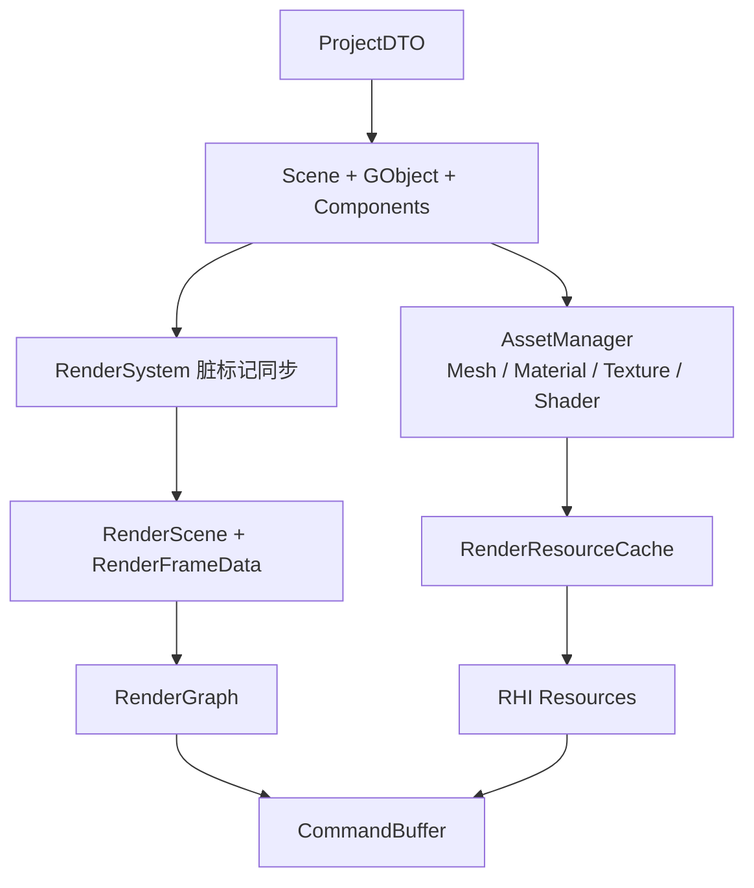

## 当前架构中值得注意的问题

### 1. 资源所有权与释放不够清晰

`RenderMeshResource::reset()` 尚未真正释放 GPU buffer；`RenderTextureResource` 创建的 `RhiTexture` 无统一 cache 与 shutdown 释放策略。

结果：同一贴图路径或同一 submesh 可能重复上传；长期存在泄漏风险。

### 2. 纹理热更新不完整

`RenderMaterialResource::updateFrom()` 仅在 `RhiTexture*` 为空时上传。贴图路径变更后，GPU 侧可能仍持有旧纹理。

`Material::version` 已写入 `material_version`，但未用于跳过/触发纹理重建。

### 3. Material 双模型字段较多

`Material` 同时保存 PBR 与 Blinn-Phong 字段，运行时由 `RenderParams::material_model` 决定绑定哪套，材质语义与渲染模式存在耦合。

### 4. ProjectDTO 保存范围仍不完整

已保存：网格对象、材质 override、相机、方向光、点光。

仍缺失：GObject 层级、稳定 object id、RenderParams、AnimationComponent 播放参数、非 OBJ 的 `FileType` 恢复逻辑。

### 5. Shader resource binding 仍是 name-based

`ShaderResourceBindings` 按 uniform name 绑定，OpenGL backend 使用 `glGetUniformLocation`。缺少 layout 校验与 location 缓存。

### 6. RenderMeshResource 按 section 拷贝，缺少共享

`rebuildObjectRenderProxy` 为每个 submesh 构造独立的 `RenderMeshResource(sub_mesh)`，同一模型多次实例化时 GPU buffer 不能复用。

---

## 初步优化方案

### 阶段一：Render Resource Cache

- **`TextureCache`**：key = 规范化路径 + gamma 标志 → `RhiTexture*`
- **`MeshCache`**：key = 模型路径 + submesh index → 共享 `RenderMeshResource`
- 统一 shutdown 释放策略

### 阶段二：完善 Material version 驱动更新

1. 编辑器修改材质属性时调用 `Material::markDirty()`。
2. `updateFrom()` 对比 `material_version`：未变则跳过；变化时更新因子并检测 texture 指针变更，通过 TextureCache 刷新 GPU 句柄。

### 阶段三：扩展 ProjectDTO

- `ObjectDTO` 增加 parent 引用或 stable uuid。
- 新增 `RenderSettingsDTO`（render path、material model、后处理开关）。
- 新增 `AnimationDTO`（speed、loop、playing）。
- 可选 `schema_version` + 迁移函数。

### 阶段四：ShaderResourceBindings 加 layout

- pipeline 创建时缓存 uniform location。
- 中期：frame/object/material UBO + texture 仍走 bindings。

### 阶段五：RenderMeshResource 共享化

- `RenderMeshSection` 持有 `shared_ptr<RenderMeshResource>` 而非值拷贝。
- 同一 `source_filepath` + `sub_mesh_idx` 共享 GPU buffer。

---

## 推荐的目标形态

原则：

- 磁盘层只保存稳定、可迁移、可重建的数据。
- CPU Logical / AssetManager 不保存 GL/RHI handle。
- `RenderScene` 是 Logical Scene 的长生命周期渲染镜像；`RenderFrameData` 是每帧 transient 视图，均不应成为 GPU 资源的唯一所有者。
- RHI 资源由 cache 或 RenderGraph 统一管理生命周期。
- RenderPass 通过 `RenderPassContext` 和 slot 绑定访问语义资源，不硬编码 attachment slot。
- ImGui 预览通过 `RenderTextureResource::id` 或专门 adapter 取得 native id，不扩散到 RenderPass 内部。

---

## 小结

当前资源管线已有清晰分层：

- **DTO + ProjectSerializer** 负责磁盘项目描述（含相机与光源）。
- **AssetManager** 负责 CPU 侧 Mesh/Material/Texture/Shader。
- **Logical** 负责 Scene/GObject/Component 与脏标记。
- **RenderSystem** 通过脏标记增量同步 `RenderScene`，每帧构建 `RenderFrameData`。
- **RHI + RenderGraph** 负责 GPU 资源与 Pass 调度。

下一步优先：

1. 建立 texture/mesh 的 render resource cache 与释放策略。
2. 完善 `Material::version` 驱动的纹理热更新。
3. 扩展 ProjectDTO（层级、RenderParams、Animation）。
4. ShaderResourceBindings 引入 layout 与 uniform location 缓存。
5. RenderMeshResource 跨实例共享。