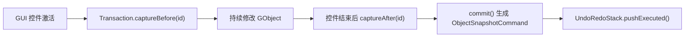
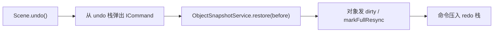
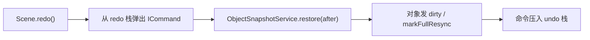

# 快照撤销重做机制

本文档说明当前 XPYEngine 编辑器 undo/redo 的快照事务方案。它覆盖 `Logical/Snapshot` 核心模块、`Scene` 持有的历史栈，以及 GUI 中 ImGuizmo、Scene Hierarchy、Context Menu、Console 等编辑入口的接入规则。

当前版本的目标是先保证正确性：一次用户操作恢复到操作前或操作后时，`GObject` 的可编辑状态应完整一致。后续如果需要性能优化、历史描述更细、内存占用更低，可以在这个机制之上引入更细粒度的命令。

---

## 设计目标

### 解决的问题

编辑器里有多种修改场景：

- Inspector 中修改 Transform、Camera、Light、Material、Mesh local transform 等属性。
- ImGuizmo 拖拽一个或多个对象。
- 右键菜单切换对象可见性。
- Console 创建或删除点光源。
- 未来还会有批量删除、多选批量编辑、复制粘贴、层级调整等操作。

这些入口的共同需求是：

- 每次 undo/redo 对应一次用户意图，而不是一帧变化或一个底层字段写入。
- 同一个用户意图可能影响多个 `GObject`。
- 创建、删除和普通属性修改都应该用同一套恢复语义。
- GUI 只负责划分编辑边界，不应该复制对象序列化和恢复逻辑。

### 当前取舍

当前选择 **GObject 快照事务** 作为第一版：

- 快照粒度是 `GObject` 的可编辑状态。
- 不是对运行时对象做深拷贝。
- 不保存 GPU/RHI handle、渲染缓存、完整 mesh 顶点数据等运行时资源。
- 通过 `ObjectDTO` 表达可恢复的编辑态。

这样做的好处是恢复语义清晰，能统一覆盖属性修改、对象创建、对象删除、批量操作。代价是单次历史项可能比细粒度命令更大，但这是第一版可接受的。

---

## 模块位置

核心代码位于：

```text
engine/src/Logical/Snapshot/
```

主要类型：

| 类型 | 职责 |
|------|------|
| `ObjectSnapshot` | 一个 `GObject` 在某个时间点的可编辑状态 |
| `ObjectSnapshotService` | 捕获、恢复、比较快照，并复用 DTO 构建/应用逻辑 |
| `ICommand` | 已提交的可撤销历史项接口 |
| `ObjectSnapshotCommand` | 基于 before/after 快照列表的命令实现 |
| `Transaction` | 一次用户意图进行中的临时捕获器 |
| `UndoRedoStack` | Scene 持有的 undo/redo 历史栈 |

`Scene` 持有一个 `Snapshot::UndoRedoStack`，并对外暴露：

```cpp
Snapshot::UndoRedoStack& undoRedoStack();
void undo();
void redo();
bool canUndo() const;
bool canRedo() const;
```

---

## 核心概念

### ObjectSnapshot

`ObjectSnapshot` 表示一个 `GObject` 在某个时间点的可编辑状态：

```cpp
struct ObjectSnapshot {
    GObjectID id{};
    ObjectDTO dto{};
    bool existed{ false };
};
```

字段语义：

- `id`：目标对象 ID。
- `dto`：对象可编辑态 DTO。对象存在时有效。
- `existed`：该时间点对象是否存在。

`existed` 是创建/删除能统一纳入 undo/redo 的关键：

| before | after | 含义 |
|--------|-------|------|
| `true` | `true` | 普通属性修改 |
| `false` | `true` | 创建对象 |
| `true` | `false` | 删除对象 |

### ObjectSnapshotService

`ObjectSnapshotService` 是快照机制的唯一 DTO 细节入口：

```cpp
static ObjectSnapshot capture(Scene& scene, GObjectID id);
static void restore(Scene& scene, const ObjectSnapshot& snapshot);
static bool equals(const ObjectSnapshot& lhs, const ObjectSnapshot& rhs);
```

语义：

- `capture()`：对象存在则构建 `ObjectDTO`，不存在则返回 `existed=false`。
- `restore()`：
  - `existed=false`：删除对象。
  - `existed=true` 且对象已存在：将 DTO 应用到现有对象。
  - `existed=true` 且对象不存在：用同一个 `GObjectID` 重建对象，再应用 DTO。
- `equals()`：比较两个快照是否等价，用于过滤 no-op 操作。

这一层复用项目保存/加载相关的 DTO 构建与应用逻辑，避免 `.proj` 序列化和 undo 恢复各写一套。

### ICommand

`ICommand` 表示已经提交到历史栈中的一次可撤销操作：

```cpp
class ICommand {
public:
    virtual ~ICommand() = default;

    virtual void undo(Scene& scene) = 0;
    virtual void redo(Scene& scene) = 0;
    virtual const std::string& label() const = 0;
};
```

注意：`ICommand` 不是编辑中的 transaction。它只保存已经完成、可以撤销或重做的操作。

### ObjectSnapshotCommand

`ObjectSnapshotCommand` 是当前主要命令实现：

```cpp
class ObjectSnapshotCommand : public ICommand {
    std::vector<ObjectSnapshot> m_before;
    std::vector<ObjectSnapshot> m_after;
};
```

一条命令保存快照列表而不是单个快照，是因为一次用户操作可能影响多个对象：

- 多选 Gizmo 同时移动多个对象。
- 批量删除多个对象。
- 未来复制粘贴、组合操作、层级操作可能同时影响多个对象。

undo 时恢复 `before`，redo 时恢复 `after`。

### Transaction

`Transaction` 表示一次用户意图的临时捕获器：

```cpp
Transaction transaction(scene, "Move Objects");
transaction.captureBefore(id);
// 用户操作修改对象
transaction.captureAfter(id);
auto command = transaction.commit();
```

内部使用：

```cpp
std::unordered_map<GObjectID, ObjectSnapshot> m_before;
std::unordered_map<GObjectID, ObjectSnapshot> m_after;
```

使用 map 的原因：

- 同一个对象在一次操作中可能被多次修改，例如拖拽每帧都在变。
- `captureBefore()` 只保留第一次状态。
- `captureAfter()` 总是覆盖为最终状态。
- 提交时按对象 ID 排序生成稳定的快照列表。

`commit()` 会过滤 no-op：如果 before 和 after 等价，则返回空命令。

### UndoRedoStack

`UndoRedoStack` 保存两组命令：

```cpp
std::vector<std::unique_ptr<ICommand>> m_undo_stack;
std::vector<std::unique_ptr<ICommand>> m_redo_stack;
```

语义：

- `pushExecuted()`：外部已经把对象改完了，把对应命令放入 undo 栈，并清空 redo 栈。
- `execute()`：命令自己负责 redo 的场景。当前 GUI 大多用 `pushExecuted()`。
- `undo()`：从 undo 栈弹出命令，执行 `undo(scene)`，压入 redo 栈。
- `redo()`：从 redo 栈弹出命令，执行 `redo(scene)`，压入 undo 栈。
- `setClean()` / `isClean()`：保存工程后标记 clean state。

---

## 数据流

### 普通属性编辑



特点：

- 控件拖动过程中不入栈。
- 拖动结束后只生成一条历史。
- 如果值没有实际变化，`commit()` 返回空，不污染历史栈。

### Undo



### Redo



---

## GUI 接入规则

GUI 层的职责是划定事务边界。它不应该直接拼 DTO，也不应该绕过 `ObjectSnapshotService` 处理恢复细节。

### 菜单和快捷键

位置：

```text
engine/src/GUI/Editor/ImGuiEditor.cpp
```

当前接入：

- `Ctrl+Z`：undo。
- `Ctrl+Y`：redo。
- `Ctrl+Shift+Z`：redo。
- Edit 菜单中根据 `canUndo()` / `canRedo()` 控制菜单项状态。

### ImGuizmo

位置：

```text
engine/src/GUI/Editor/ImGuiToolbar.cpp
```

事务边界：

- 第一次检测到对象被 Gizmo 操作时，创建 `Transaction`。
- 对当前选中的所有对象 `captureBefore()`。
- 拖拽过程中持续修改 Transform，但不入栈。
- 拖拽结束时对当前选中对象 `captureAfter()`，提交命令。

标签：

- 平移：`Move Objects`
- 旋转：`Rotate Objects`
- 缩放：`Scale Objects`

这个设计天然支持多选对象，因为一条 `ObjectSnapshotCommand` 可以保存多个对象的 before/after。

### Scene Hierarchy / Inspector

位置：

```text
engine/src/GUI/Editor/ImGuiSceneHierarchy.cpp
```

当前接入的编辑类型：

- `TransformComponent`
- `CameraComponent`
- `MeshComponent` 中 submesh local transform
- `Material` 参数
- `PointLightComponent`
- `DirectionalLightComponent`
- `AnimationComponent` 部分字段
- 泛型 `Vec3`、`Vec4`、`float`、`int`、`bool` 字段

连续拖动控件规则：

```cpp
if (ImGui::IsItemActivated())
    beginObjectTransaction(object, label);

if (changed)
    writeValueToObject();

if (ImGui::IsItemDeactivatedAfterEdit())
    endObjectTransaction(object);
```

一个重要细节：`DragFloat` / `DragInt` 不能直接把对象字段传给 ImGui 后再捕获 before，否则第一帧修改可能已经发生。当前实现使用临时变量：

```cpp
float next_value = value;
bool changed = ImGui::DragFloat(..., &next_value, ...);
// 激活时 captureBefore
if (changed)
    value = next_value;
// 结束后 captureAfter
```

向量控件本来就是先写到临时 `Vec4 values`，最后统一写回，因此 after 快照放在写回之后提交。

离散控件规则：

- reset 按钮、checkbox 等一次点击完成的操作使用 immediate edit。
- immediate edit 内部会 capture before、执行 edit、capture after、commit。

### Context Menu

位置：

```text
engine/src/GUI/Editor/ImGuiContextMenu.cpp
```

当前接入：

- 右键对象菜单中的 `Visible` 切换会生成 `Toggle Visibility` 历史项。

`GObject::setVisible()` 自己负责发 dirty，菜单只负责事务捕获和入栈。

### Global Console

位置：

```text
engine/src/GUI/Editor/ImGuiGlobalConsole.cpp
```

当前接入：

- `+` 创建点光源：before 为 `existed=false`，after 为创建后的对象快照。
- `-` 删除最后一个点光源：before 为删除前快照，after 为 `existed=false`。

这样 redo 创建时能恢复同一个 `GObjectID`，undo 删除时也能恢复同一个对象 ID。

---

## Scene 生命周期规则

### 加载工程

`Scene::loadProject(clear_old=true)` 成功后会清空 undo/redo 历史。

原因：加载新工程相当于替换当前编辑上下文，旧历史项引用的对象 ID 和 DTO 不再有可靠语义。

### 保存工程

`Scene::saveProject()` 成功后调用 `UndoRedoStack::setClean()`。

后续 UI 可以用 `isClean()` 做窗口标题星号、保存按钮状态、退出确认等。

---

## 快照内容边界

当前 `ObjectSnapshot` 保存的是 `ObjectDTO` 能表达的编辑态，主要包括：

- 对象名称和可见性。
- Transform。
- Mesh 来源路径、submesh local transform。
- Material 参数和贴图路径。
- Camera 参数。
- Point light / directional light 参数。

当前不保存：

- GPU/RHI handle。
- RenderScene 缓存。
- 完整 mesh 顶点和索引数据。
- 运行时临时帧数据。
- 不在 `ObjectDTO` 里的编辑器状态。

原则：快照只保存能从 Logical/Asset 描述重新恢复的状态。渲染层状态通过 dirty 同步重新生成。

---

## 正确性注意点

### 一次用户意图只提交一次

不要在拖拽每一帧调用 `pushExecuted()`。正确做法是拖拽开始 capture before，拖拽结束 commit。

### before 必须早于第一次写对象

如果 ImGui 控件会直接修改传入值，必须用临时变量承接控件输出。否则 before 可能已经是修改后的值，undo 会失效或只能回到中间状态。

### after 必须晚于最终写对象

向量控件、复合控件、Gizmo 等都要确保最终对象字段已经写完，再 `captureAfter()`。

### GUI 不直接恢复对象

GUI 只创建事务和命令，不自己写恢复逻辑。恢复逻辑统一放在 `ObjectSnapshotService`。

### 对象创建和删除要保留 ID

删除 undo、创建 redo 都要求恢复同一个 `GObjectID`，否则选择、dirty、未来引用关系都可能变得不稳定。

---

## 后续演进方向

当前快照方案是正确性优先的通用 fallback。后续可以逐步加入细粒度命令，但不需要替换掉快照机制。

### 细粒度命令

可选方向：

- `TransformCommand`：保存对象 ID、before/after Transform。
- `VisibilityCommand`：保存对象 ID、before/after bool。
- `MaterialParamCommand`：保存对象 ID、submesh index、材质字段、before/after 值。
- `LightParamCommand`：保存光源参数变更。
- `CameraParamCommand`：保存相机参数变更。

适用场景：

- 高频操作。
- 大对象快照成本较高。
- 希望菜单显示更具体的历史描述。

### 历史 label

当前 `ICommand::label()` 已提供描述文本。后续 UI 可以显示：

- `Undo Move Objects`
- `Redo Edit Material Roughness`

### 组合命令

未来可加入 `CompositeCommand`：

- 一个用户操作内部由多条细粒度命令组成。
- 对外仍作为一条历史项撤销/重做。
- Snapshot command 继续作为复杂操作的 fallback。

### 内存和性能

可选优化：

- 历史容量按内存大小而不是条数控制。
- 大 DTO 使用共享字符串或路径 intern。
- 对大对象只保存变更字段。
- 对连续编辑做 command merge。

---

## 当前结论

当前 undo/redo 的核心语义是：

- `Transaction` 表示一次正在发生的用户意图。
- `ICommand` 表示一次已经提交的可撤销用户操作。
- `ObjectSnapshotCommand` 用 GObject before/after 快照恢复状态。
- `UndoRedoStack` 保存历史并提供 undo/redo/clean state。
- GUI 只负责事务边界，不负责恢复细节。

这套机制优先保证编辑器行为正确、入口一致、恢复路径统一。后续细粒度命令应该作为优化层叠加，而不是绕开这套基础语义。
