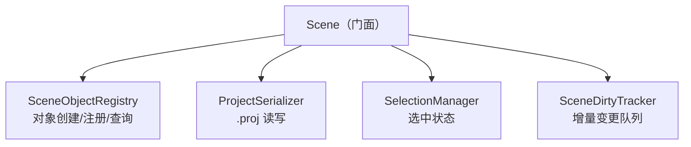
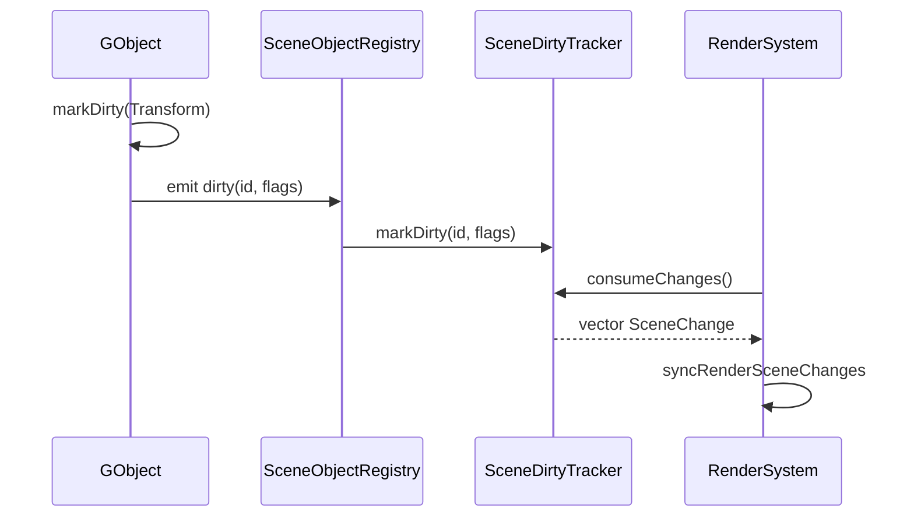
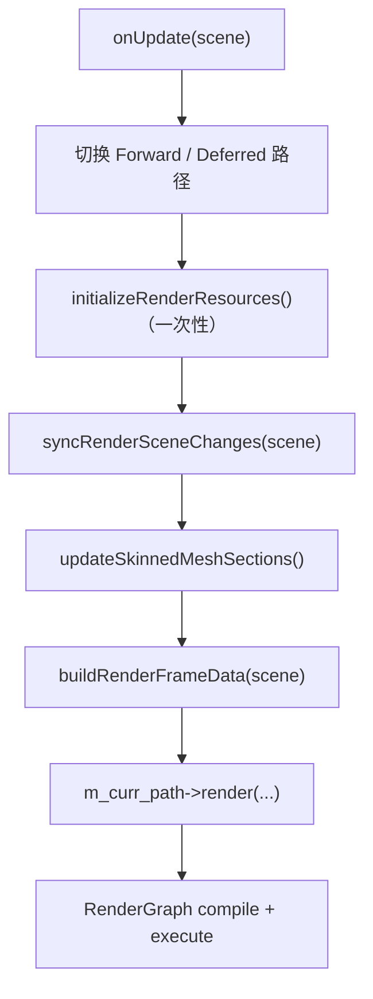
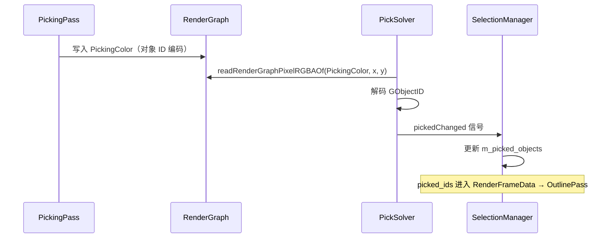

# 架构总览

项目引擎源码位于 `engine/src`，编译产物为静态库 **EngineRuntime**。公开 API 在 `engine/include/Engine.hpp`。

当前采用分层架构，每层只向下依赖，上层通过接口或数据结构与下层交互：

```
┌─────────────────────────────────────────┐
│  GUI（ImGui 编辑器、输入、拾取）            │
├─────────────────────────────────────────┤
│  Render（渲染系统、RenderGraph、RHI、Pass）│
├─────────────────────────────────────────┤
│  Logical（场景、对象、组件、动画）          │
├─────────────────────────────────────────┤
│  AssetManager（网格、材质、纹理、模型导入）  │
├─────────────────────────────────────────┤
│  Platform（GLFW 窗口、文件对话框）         │
├─────────────────────────────────────────┤
│  Base（基础设施：数学、日志、信号槽、序列化）  │
└─────────────────────────────────────────┘
```

**依赖顺序：** GUI → Render → Logical → AssetManager → Platform → Base。

**原则：** 上层只能依赖下层；下层不引用上层的业务类型。

**横切组件：** `GlobalContext`（`engine/src/GlobalContext.hpp`）持有各层核心实例，作为运行时服务定位器贯穿全局。它打破了 include 层面的严格单向依赖，但初始化顺序仍体现分层关系：

```
Window → Scene → RenderSystem → ImGuiEditor → GUIInput → AnimationSystem
```

**主要跨层数据流：**

```
Logical Scene  ──(脏标记)──▶  RenderSystem.syncRenderSceneChanges  ──▶  RenderScene
AnimationSystem ──(骨骼矩阵)──▶  RenderSystem.updateSkinnedMeshSections
RenderSystem    ──(FinalColor)──▶  GUI MainCanvas
GUI PickSolver  ──(PickingColor)──▶  Scene SelectionManager
```

资源在磁盘、CPU 逻辑层与 GPU 渲染层之间的详细流转，见 [资源管理.md](资源管理.md)。

---

## Base（基础设施层）

**位置：** `engine/src/Base/include/Base/`

Base 层提供与业务无关的通用能力，不引用 Platform / AssetManager / Logical / Render / GUI。

| 模块 | 路径 | 职责 |
|------|------|------|
| 公共类型 | `Common.hpp` | 聚合头；引擎常用别名与颜色类型 |
| 数学 | `Math/` | `Vector.hpp`、`Matrix.hpp`、`Math.hpp`、`Rect.hpp`；基于 glm 封装 |
| 日志 | `Logger/Logger.hpp` | spdlog 封装 |
| 计时 | `Timer/Timer.hpp` | 帧计时，供 `Engine::run()` 门控 |
| 信号槽 | `Signal/Signal.hpp`、`Slot.hpp` | 轻量 pub-sub；`connect()` 绑定成员函数或 `std::function` |
| 序列化 | `Meta/Serializer.hpp` | 基于 TinyReflection + json11 的 JSON 读写 |
| 工具 | `Utils/PathService.hpp`、`Utils.hpp` | 路径拼接、后缀名、相对路径等 |

**设计要点：**

- **Signal/Slot**：`GObject` 的 `dirty` 信号、`PickSolver` 的 `pickedChanged` 均基于此实现，宏 `emit` / `signals` / `slots` 模拟 Qt 风格。
- **Serializer**：`.proj` 工程文件与 Scene Hierarchy 属性面板共用同一套 Meta 注册（`AllMetaRegister.hpp`）。

---

## Platform（平台层）

**位置：** `engine/src/Platform/`

Platform 封装操作系统与窗口系统，不依赖 Logical / Render / GUI。

| 类型 | 文件 | 职责 |
|------|------|------|
| `Window` | `Window.hpp/.cpp` | GLFW 窗口生命周期；创建 OpenGL Context（Windows/Linux 4.3 Core，macOS 4.1 Core + Forward Compatible）；`swapBuffer()` |
| `FileDialog` | `FileDialog.hpp` | 抽象基类：`OpenFile()` / `SaveFile()` |
| `WindowsFileDialog` | `Platform/Windows/` | Windows 原生对话框 |
| `MacFileDialog` | `Platform/Mac/` | macOS 原生对话框（`.mm`） |
| `NullFileDialog` | `Window.cpp` 内联 | 非 Win/Mac 平台的空实现 |

**设计要点：**

- **策略模式**：`Window::createFileDialog()` 按平台返回具体实现。
- Linux 可编译运行，但文件对话框返回空路径，Open/Save Project 在此平台不可用。

---

## AssetManager（资源与数据交换层）

**位置：** `engine/src/AssetManager/`

AssetManager 负责「外部文件 → 引擎内部 CPU 侧数据结构」的转换，不持有 GPU 句柄，不依赖 Logical / Render / GUI。

| 类型 | 文件 | 职责 |
|------|------|------|
| `Mesh` / `Vertex` | `Mesh.hpp/.cpp` | 顶点/索引数组、submesh 索引范围、骨骼权重（`MAX_BONE_INFLUENCE=4`） |
| `Material` | `Material.hpp/.cpp` | 同时保存 PBR 与 Blinn-Phong 字段；`version` 脏标记；`fillPBRFromBlinnPhong()` 互转 |
| `Texture` / `CubeTexture` | `Texture.hpp/.cpp` | CPU 像素数据（stb_image 加载），不含 GL 句柄 |
| `Shader` | `Shader.hpp/.cpp` | `ShaderType` 枚举 → GLSL 文件路径映射；`#include` 解析 |
| `ModelImporter` | `ModelImporter.hpp/.cpp` | Assimp 导入模型、材质、骨骼动画；静态 importer 缓存 |
| `MeshAlgorithm` | `MeshAlgorithm.hpp/.cpp` | 程序化网格：screen quad、cube、icosphere 等 |
| `DTO` | `include/AssetManager/DTO.hpp` | `.proj` 序列化结构体 |

**设计要点：**

- CPU 侧资源与 GPU 资源严格分离：AssetManager 只描述「有什么数据」，GPU 上传在 Render 层的 `RenderMeshResource` / `RenderMaterialResource` / `RenderTextureData` 中完成。
- `ModelImporter` 根据 Assimp shading model 或文件格式（如 glTF）自动判断 PBR / Blinn-Phong 路径，并填充两套兼容字段。

---

## Logical（逻辑层）

**位置：** `engine/src/Logical/`

Logical 描述「场景里有什么、对象如何组织、状态如何更新」，不直接操作 GPU，不依赖 Render / GUI。

### 目录结构

```
Logical/
├── include/Logical/Framework/
│   ├── Object/GObject.hpp          # 场景对象节点
│   ├── Component/                  # 组件基类与各具体组件
│   └── World/
│       ├── Scene.hpp               # 场景门面
│       ├── SceneObjectRegistry.hpp # 对象注册与创建
│       ├── ProjectSerializer.hpp   # .proj 读写
│       ├── SelectionManager.hpp    # 拾取选中
│       ├── SceneDirtyTracker.hpp   # 脏标记队列
│       └── SceneDirty.hpp          # 脏标记枚举
├── Framework/World/*.cpp           # 上述子系统实现
├── Framework/ECS/                  # 可选 ECS（ENABLE_ECS 编译开关）
├── Animation/                      # 骨骼动画
└── Input/                          # 相机操控（CameraManipulator）
```

### Scene 门面与子系统

`Scene` 不直接持有所有数据，而是聚合四个子系统，对外提供统一 API：



| 子系统 | 职责 |
|--------|------|
| **SceneObjectRegistry** | 创建/注册/移除 `GObject`；维护主相机 ID、方向光/点光 ID 列表；`loadModel()` 调用 `ModelImporter`；连接 `GObject::dirty` 信号 |
| **ProjectSerializer** | `loadProject()` / `saveProject()`；DTO ↔ Scene 互转；保存对象、变换、材质、相机、光源 |
| **SelectionManager** | 维护 `m_picked_objects`；响应 `onPickedChanged` |
| **SceneDirtyTracker** | 收集 `SceneChange{ object_id, flags }`；支持 `FullResync`；`consumeChanges()` 供 Render 消费 |

**Scene 初始化**（`Scene.cpp`）：构造时自动创建主相机与默认方向光。

### GObject / Component

默认模式为 **GObject + Component**（`ENABLE_ECS=false`）。ECS 实现在 `Logical/Framework/ECS/`，编译时未启用。

**GObject**（`GObject.hpp/.cpp`）：

- 场景树节点：parent / children 层级
- 稳定标识：`GObjectID`（全局递增）
- 组件容器：`std::vector<std::shared_ptr<Component>>`
- 模板 API：`addComponent<T>()`、`getComponent<T>()`、`hasComponent<T>()`
- 脏标记：`markDirty(SceneDirtyFlags)` → `emit dirty(object_id, flags)`

**组件列表：**

| 组件 | 职责 |
|------|------|
| `TransformComponent` | TRS → `Mat4 transform()` |
| `MeshComponent` | `source_filepath` + `vector<shared_ptr<Mesh>> sub_meshes` |
| `CameraComponent` | Orbit/FPS 模式、透视/正交、FOV、near/far、view/projection 矩阵 |
| `DirectionalLightComponent` | 方向、颜色、正交 shadow 投影参数 |
| `PointLightComponent` | 位置（Transform）、颜色、半径、6 面 cubemap view 矩阵 |
| `AnimationComponent` | `shared_ptr<Animation> clip`、播放速度/循环/开关 |
| `RigidComponent` | 占位组件 |

**光源组件化：** 方向光与点光均为带 `LightComponent` 的 `GObject`，由 Registry 维护 ID 列表，RenderSystem 遍历 Scene 收集光照数据。

### 脏标记与 Render 同步



**SceneDirtyFlag 枚举：**

| 标志 | 含义 | Render 侧处理 |
|------|------|---------------|
| `Created` / `Mesh` | 新对象或网格变更 | `rebuildObjectRenderProxy` |
| `Removed` | 对象删除 | `removeObjectProxy` |
| `Visibility` | 可见性变更 | `setObjectVisible` |
| `Transform` | 变换变更 | `updateObjectTransform` |
| `Material` | 材质变更 | `updateObjectMaterials` |
| `FullResync` | 全量重建 | `rebuildRenderSceneFromScene` |

`SceneDirtyTracker` 构造时 `m_full_resync = true`，首帧触发全量同步。

### Animation

**AnimationSystem**（`AnimationSystem.hpp`，header-only）：

- 遍历 Scene 中带 `AnimationComponent` 的对象
- 维护每对象的 `ObjectAnimationState`（clip、current_time、final_bone_matrices）
- 递归 `CalculateBoneTransform` 计算骨骼 palette（上限 `MAX_BONE_PALETTE_SIZE`）
- 由 `GlobalContext` 持有；主循环在 Render 之前 `onUpdate(scene, dt)`

RenderSystem 通过 `g_context.animation_system->GetFinalBoneMatrices(object_id)` 读取骨骼矩阵，写入 `RenderMeshSection::bone_matrices`。

### Input

**CameraManipulator**（`Input/CameraManipulator.hpp/.cpp`）：

- 绑定 `CameraComponent`
- 支持 orbit / pan / zoom / WASD
- 需 `syncContext(IntRect view_rect)` 同步 MainCanvas 视口

实际输入采集由 GUI 层 `GUIInput` 驱动（见 GUI 节）。

---

## Render（渲染层）

**位置：** `engine/src/Render/`

Render 把 Logical 层数据转换为 GPU 可执行的绘制过程。依赖 Base、AssetManager、Logical（及运行时通过 GlobalContext 访问 AnimationSystem）。

### 核心类型

| 类型 | 文件 | 职责 |
|------|------|------|
| `RenderSystem` | `RenderSystem.hpp/.cpp` | 渲染总调度；路径切换；Scene → RenderScene 同步；IBL 构建 |
| `RenderScene` | `RenderScene.hpp/.cpp` | 长生命周期的渲染代理数据库 |
| `RenderFrameData` | `RenderFrameData.hpp` | 每帧 transient 数据（相机、灯光、picked_ids） |
| `RenderBuiltinResources` | `RenderBuiltinResources.hpp` | screen quad、点光 inst mesh、skybox、IBL |
| `RenderParams` | `RenderParams.hpp` | 渲染路径、材质模型、后处理、效果开关、分辨率预设 |
| `RenderPipelineLibrary` | `RenderPipelineLibrary.hpp/.cpp` | 按 ShaderType 缓存 `RhiGraphicsPipeline` |

### RenderScene 镜像结构

Logical 的 `GObject` + `MeshComponent` 在 Render 侧映射为：

```
RenderScene
└── RenderObjectProxy（对应一个 GObjectID）
    └── RenderMeshSection[]（对应 sub_mesh_idx）
        ├── RenderMeshResource（GPU buffer + vertex layout）
        ├── RenderMaterialResource（GPU texture + 材质因子）
        ├── model_matrix
        └── bone_matrices（蒙皮时）
```

`RenderScene` 维护 pass 消费的分类列表：`visibleMeshSections`、`opaqueMeshSections`、`transparentMeshSections`、`skinnedMeshSections`。

### RenderSystem 每帧流程



**initializeRenderResources**（一次性）：创建 screen quad、点光 instancing mesh、skybox cubemap、`buildIBLResources()`。

**buildRenderFrameData**：从 Scene 收集方向光/点光（遍历带 LightComponent 的 GObject）、主相机矩阵、选中 ID。

### RenderPath

| 路径 | 文件 | 状态 |
|------|------|------|
| `ForwardRenderPath` | `Path/ForwardRenderPath.cpp` | 已接入 RenderSystem |
| `DeferredRenderPath` | `Path/DeferredRenderPath.cpp` | 已接入，默认路径 |
| `RayTracingRenderPath` | `Path/RayTracingRenderPath.cpp` | 已实现，RenderSystem 未挂载 |

每条 RenderPath 持有 `unordered_map<RenderPass::Type, unique_ptr<RenderPass>>` 和 `RenderGraph m_render_graph`。**每帧**在 `render()` 内重建图节点 → `compile()` → `execute()`。

**Forward 路径 Pass 顺序：**

```
Picking → Shadow → MeshForwardLighting → SkyBox → Outline → Final
```

**Deferred 路径 Pass 顺序：**

```
Picking → Shadow → GBuffer → [SSAO] → DeferredLighting → Transparent
→ SkyBox → Outline → [CheckerBoard] → [WireFrame] → [Normal]
→ [Bloom] → [FXAA] → [ToneMapping] → Final → FinalColor
```

方括号内 Pass 按 `RenderParams` 开关启用。后处理链采用 ping-pong 资源（`SceneColor` → `BloomColor` → `FXAAColor` → `ToneMappingColor`），避免读写同一纹理。

**注意：** `ZPrePass` 在 `DeferredRenderPath` 构造中注册，但未加入 RenderGraph（预留）。

### RenderGraph

**位置：** `Render/Graph/`

| 类型 | 职责 |
|------|------|
| `RenderGraph` | 声明 Pass 节点、资源读写、FBO 管理；`compile()` 拓扑排序 + 环检测；`execute()` 驱动 Pass |
| `RenderGraphPassNode` | Fluent API：`.addPass()`、`.read()`、`.modify()`、`.color()`、`.depth()`、`.setEnabled()`、`.setSetup()` |
| `RenderPassContext` | Pass 执行上下文：访问 texture / FBO / RenderScene / FrameData / BuiltinResources |
| `RenderGraphDumper` | 人类可读的图结构与执行顺序 dump |

**资源命名空间**（`RenderGraphPassNode.hpp`）：

- `RGResource::*`：语义纹理名，如 `SceneColor`、`GBufferPosition`、`FinalColor`、`PickingColor`
- `RGTarget::*`：FBO 目标名，如 `Main`、`ScreenFrameBuffer`、`ShadowPointDepth`

**RenderPass 槽位绑定：** Pass 通过 `bindSlot("inColor", RGResource::SceneColor)` 解耦硬编码，在 `draw(RenderPassContext&)` 中通过 `context.texture(slot("inColor"))` 访问资源。

### RenderPass 列表

| Pass | 职责 |
|------|------|
| `PickingPass` | 写入对象 ID 到 `PickingColor` |
| `ShadowPass` | 方向光 + 点光 cubemap 阴影 |
| `GBufferPass` | 延迟 G-Buffer（PBR / Blinn-Phong 两套 layout） |
| `DeferredLightingPass` | 延迟光照（IBL / SSAO / 阴影采样） |
| `SSAOPass` | 屏幕空间环境光遮蔽 |
| `TransparentPass` | Alpha 混合透明物体 |
| `MeshForwardLightingPass` | 前向光照 |
| `SkyBoxPass` | Cubemap 天空 |
| `OutlinePass` | 选中物体描边 |
| `BloomPass` | HDR Bloom |
| `FXAAPass` | 快速近似抗锯齿 |
| `ToneMappingPass` | 色调映射 + 曝光 |
| `WireFramePass` / `NormalPass` / `CheckerBoardPass` | 调试可视化 |
| `FinalPass` | Blit 到屏幕 + 可选地面网格叠加 |
| `RayTracingPass` | 全屏路径追踪（未接入主路径） |

### RHI

**位置：** `Render/RHI/`

- **抽象层**（`rhi.hpp`）：`Rhi`、`RhiBuffer`、`RhiTexture`、`RhiFrameBuffer`、`RhiGraphicsPipeline`、`RhiCommandBuffer`、`RhiVertexLayout`、`RhiShaderResourceBindings`
- **实现层**（`RHI/OpenGL/`）：OpenGL 后端；`Rhi::create()` 单例初始化
- **管线缓存**：`RenderPipelineLibrary` 按 `ShaderType` + `RenderPipelineState` + `RhiVertexLayout` 缓存 pipeline

RenderPass 持有 `RhiCommandBuffer*`，通过 `setGraphicsPipeline` → `setShaderResources` → `setVertexInput` → `drawIndexed` 提交绘制。

### IBL

**位置：** `Render/IBL/`

- `IBLPreprocessor`：启动阶段一次性预计算
- 优先从 HDR 等距柱状图（`RenderParams.ibl.env_hdr_path` 或默认 `asset/images/ibl/environment.hdr`）构建
- 回退：从 skybox cubemap 派生 irradiance / prefilter / BRDF LUT
- 结果存入 `RenderBuiltinResources.ibl`，DeferredLightingPass / ForwardPass 采样

### 渲染参数

`RenderParams`（`RenderParams.hpp`）默认值：

| 参数 | 默认值 |
|------|--------|
| `render_path_type` | `Deferred` |
| `material_model` | `PBR` |
| `render_resolution` | `UHD_4K`（3840×2160） |
| `shadow_params.enable` | `true` |
| `ssao.enable` | `true` |
| `ibl.enable` | `true` |
| `post_processing_params.bloom/fxaa/tone_mapping` | `true` |

内部渲染分辨率与窗口尺寸解耦；切换分辨率预设时调用 `RenderSystem::rebuildRenderTargets()`。

---

## GUI（编辑器与交互层）

**位置：** `engine/src/GUI/`

GUI 提供编辑器界面，读写在 GlobalContext 中的 Scene 与 RenderParams，依赖 Base、Platform、Logical、Render。

### 目录结构

```
GUI/
├── include/GUI/Editor/ImGuiEditor.hpp
└── Editor/
    ├── ImGuiEditor.cpp          # 主编辑器、菜单栏、Dock 布局
    ├── ImGuiCanvas.cpp          # MainCanvas 视口
    ├── ImGuiToolbar.cpp         # ImGuizmo 工具栏
    ├── ImGuiSceneHierarchy.cpp  # 场景树 + 属性面板
    ├── ImGuiGlobalConsole.cpp   # 渲染参数控制台
    ├── ImGuiDebugWindow.cpp     # RenderGraph 调试
    ├── ImGuiContextMenu.cpp     # 右键菜单
    └── ImGuiInput.cpp           # GUIInput + PickSolver
```

### 面板职责

| 面板 | 职责 |
|------|------|
| **MainCanvas** | 显示 `RGResource::FinalColor` 纹理；同步主相机 aspect；承载 ImGuizmo |
| **ImGuiToolbar** | 平移 / 旋转 / 缩放 Gizmo |
| **Scene Hierarchy** | 列出 Scene 中 GObject；TinyReflection 驱动属性编辑（Transform、Material、Light、Camera） |
| **Console** | 切换渲染路径、分辨率、材质模型、效果与后处理参数；增删点光源 |
| **Debug Window** | RenderGraph 中间纹理预览、深度 remap、图结构 dump |
| **Context Menu** | 空白处 / 对象处右键（Add Cube/Sphere 等待实现） |
| **MenuBar** | File：Open Project / Open / Save Project / Save Project As |

ImGui 初始化启用 Docking + Multi-Viewport；默认布局为 Hierarchy（左）、Console（下）、MainCanvas（右）。

### 输入流

**主循环顺序**（`Engine.cpp`）：

```
beginFrame → GUIInput.onUpdate → AnimationSystem → RenderSystem → ImGuiEditor.onUpdate → [external GUI] → endFrame → swapBuffer
```

**GUIInput::onUpdate**：

1. `CameraManipulator.syncContext(mainCanvasRect)`
2. `refreshState()`：仅当鼠标在 MainCanvas 内且 `!io.WantCaptureMouse` 时采集
3. Dragging → 相机 orbit/pan
4. Holding→Released → `PickSolver.onPicking()`；右键释放 → 弹出 Context Menu
5. 滚轮 / WASD → 相机缩放 / 平移

### GPU Picking 流程



坐标映射：鼠标位置按 `RenderParams.renderTargetPixels()` 缩放，Y 轴翻转（OpenGL 左下原点）。Ctrl 按住时多选（`retain_old`）。

---

## 横切关注点

### Engine 主循环

**文件：** `engine/include/Engine.hpp`、`engine/src/Engine.cpp`

- `Engine::get()`：Meyers 单例
- `run()`：720 FPS 定时器门控；循环直到 `window->shouldClose()`
- `init()` / `shutdown()`：`shutdown()` 销毁 GLFW 窗口
- `Scene()`：返回 `g_context.scene`

### GlobalContext

```cpp
struct GlobalContext {
    std::shared_ptr<Window>           window;
    std::shared_ptr<Scene>            scene;
    std::shared_ptr<RenderSystem>     render_system;
    std::shared_ptr<ImGuiEditor>      gui_editor;
    std::shared_ptr<GUIInput>         gui_input;
    std::shared_ptr<AnimationSystem>  animation_system;
};
extern GlobalContext g_context;
```

构造时调用 `Meta::Registration::allMetaRegister()` 注册反射元数据。

### 扩展接口

| API | 用途 |
|-----|------|
| `Engine::setExternalOpenFileHandler(handler)` | File → Open 时，模型加载失败后尝试外部处理；返回 `true` 表示已处理 |
| `Engine::setExternalGuiCallback(callback)` | 每帧 `gui_editor->onUpdate()` 之后追加 ImGui 绘制 |

### 编译配置

| 宏 / 选项 | 值 | 含义 |
|-----------|-----|------|
| `ASSET_DIR` | `engine/asset/` 绝对路径 | 着色器与内置资产根目录 |
| `ENABLE_ECS` | `false` | 使用 GObject+Component 而非 ECS |
| `NO_TITLE_BAR` | `false` | 是否隐藏系统标题栏 |
| C++ 标准 | C++17 | `target_compile_features(EngineRuntime PRIVATE cxx_std_17)` |

---

## 层间依赖验证

| 层 | 直接依赖 |
|----|----------|
| Base | 第三方库（glm、spdlog、json11、TinyReflection） |
| Platform | GLFW |
| AssetManager | Base |
| Logical | Base、AssetManager |
| Render | Base、AssetManager、Logical（+ GlobalContext 运行时） |
| GUI | Base、Platform、Logical、Render、GlobalContext |
| Engine | 全部（通过 GlobalContext 编排） |

**已知跨层耦合点（文档化，非设计缺陷）：**

1. `GlobalContext` 作为服务定位器，各层通过 `g_context` 互访
2. `RenderSystem` 直接读取 `g_context.animation_system` 的骨骼矩阵
3. `RenderFrameData.hpp` / `RenderScene.hpp` 头文件引用 `GObjectID` / `GObject`
4. `MainCanvas` 通过 `RenderSystem::renderGraphTextureOf` 取得 GL 纹理 ID 供 ImGui 显示

---

## 快速导航

| 关注点 | 路径 |
|--------|------|
| 引擎入口与主循环 | `engine/src/Engine.cpp` |
| 全局上下文 | `engine/src/GlobalContext.hpp` |
| 场景门面 | `engine/src/Logical/include/Logical/Framework/World/Scene.hpp` |
| 项目序列化 | `engine/src/Logical/Framework/World/ProjectSerializer.cpp` |
| 渲染调度 | `engine/src/Render/RenderSystem.cpp` |
| 延迟渲染路径 | `engine/src/Render/Path/DeferredRenderPath.cpp` |
| 前向渲染路径 | `engine/src/Render/Path/ForwardRenderPath.cpp` |
| RenderGraph | `engine/src/Render/Graph/RenderGraph.cpp` |
| RHI 抽象 | `engine/src/Render/RHI/rhi.hpp` |
| 编辑器 | `engine/src/GUI/Editor/ImGuiEditor.cpp` |
| 输入与拾取 | `engine/src/GUI/Editor/ImGuiInput.cpp` |
| 着色器资产 | `engine/asset/shader/` |
| 构建配置 | `engine/src/CMakeLists.txt`、`thirdparty/CMakeLists.txt` |
