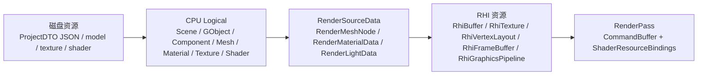
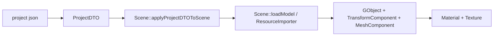
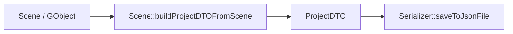
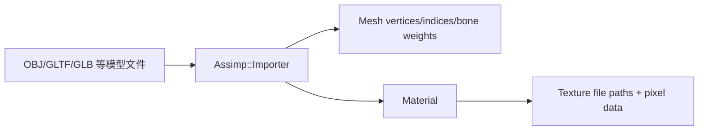
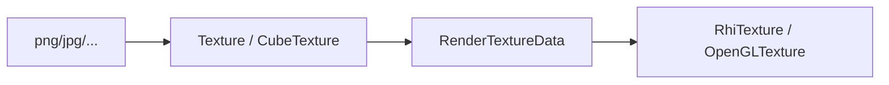
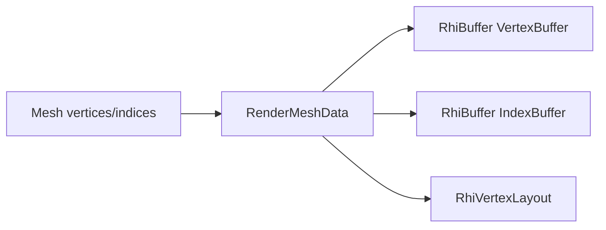
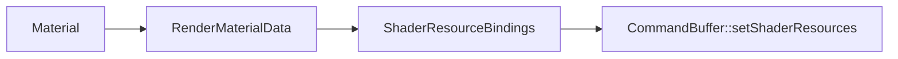
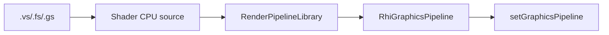
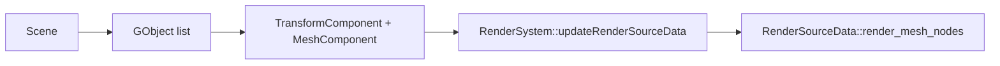
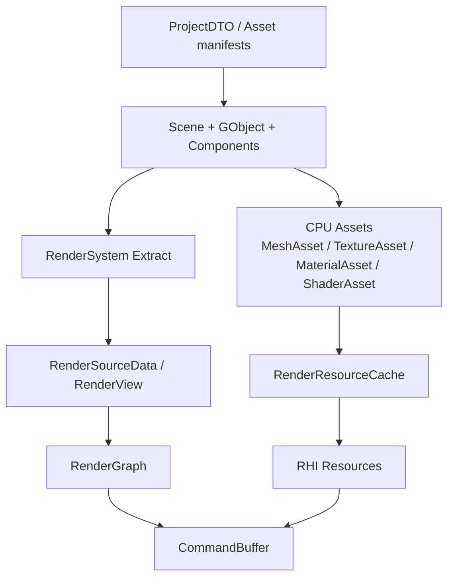

# XPYEngine 资源生命周期梳理

本文梳理当前项目中 mesh、light、shader、material、texture、GObject、Component 等资源在三个层面的表现形式：

- 磁盘层：项目 JSON、模型文件、纹理文件、shader 文件，以及用于序列化的 DTO。
- CPU Logical 层：`Logical` 目录下的运行时对象、组件和资产数据。
- GPU / Render 层：`RenderSourceData`、RenderGraph、RHI 资源，以及 RenderPass 如何消费这些数据。

本文描述的是当前代码状态，并在最后给出一版初步优化方案。

## 总览

当前资源大体按下面的路径流动：



核心入口：

- 项目保存/加载：`Scene::saveProject()`、`Scene::loadProject()`。
- 模型导入：`ResourceImporter`，通过 Assimp 读模型、材质、骨骼权重。
- CPU 到渲染数据同步：`RenderSystem::updateRenderSourceData()`。
- GPU 资源创建：`RenderMeshData`、`RenderTextureData`、RenderGraph、RHI backend。
- 绘制：RenderPass 使用 `RhiCommandBuffer`、`RhiGraphicsPipeline`、`ShaderResourceBindings`。

## 三层职责

### 1. 磁盘层

磁盘层不是完整运行时对象的 dump，而是“可重建场景”的描述。

主要类型在 `engine/src/ResourceManager/DTO.hpp`：

- `ProjectDTO`
  - `schema_version`
  - `project_name`
  - `objects`
- `ObjectDTO`
  - `name`
  - `visible`
  - `transform`
  - `filepath`
  - `file_type`
  - `sub_meshes`
  - `materials`
- `SubMeshDTO`
  - `sub_mesh_index`
  - `local_transform`
- `MaterialDTO`
  - PBR 因子：`base_color_factor`、`metallic_factor`、`roughness_factor`、`ao_factor`
  - Blinn-Phong 因子：`diffuse_factor`、`specular_factor`、`shininess`
  - `alpha`
  - `textures`
- `MaterialTexturesDTO`
  - `diffuse/specular/normal/height`
  - `albedo/metallic/roughness/ao`
- `TransformDTO`
  - `translation/rotation/scale`

项目 JSON 只保存引用和编辑态参数。模型顶点、索引、骨骼、纹理像素不直接写入 ProjectDTO，而是通过 `ObjectDTO::filepath` 和 `MaterialTexturesDTO` 中的路径重建。

其他磁盘资源：

- 模型文件：OBJ、GLTF、GLB 等由 Assimp 支持的文件。当前 `FileType` 声明了 `OBJ/STL/JSON/CustomCube/...`，但 `Scene::applyProjectDTOToScene()` 目前主要处理 `OBJ` 和 `None`。
- 纹理文件：由 `Texture` 通过 stb_image 加载。
- Shader 文件：位于 `ASSET_DIR/shader` 下，`Shader::create(ShaderType)` 硬编码 ShaderType 到 `.vs/.fs/.gs` 路径的映射。
- 项目序列化：`Meta::Serialization::Serializer` 通过 `AllMetaRegister.hpp` 中注册的 DTO 属性读写 JSON。

### 2. CPU Logical 层

CPU Logical 层表示编辑器和游戏逻辑看到的对象。

主要对象：

- `Scene`
  - 持有 `m_objects`
  - 持有 `LightManager`
  - 持有主相机 `CameraComponent`
  - 支持项目加载/保存
- `GObject`
  - 运行时对象节点
  - 有 `GObjectID`、`name`、`visible`
  - 有 `children`
  - 有 `std::vector<std::shared_ptr<Component>>`
- `Component`
  - 当前主流程是 `Logical/Framework/Component/*`
  - 另有 `Logical/Framework/ECS/Components.hpp`，但在当前 `!ENABLE_ECS` 路径下不是主流程
- `Mesh`
  - CPU 顶点、索引、submesh 信息、局部 transform、材质指针
- `Material`
  - 同时保存 PBR 和 Blinn-Phong 参数
  - 保存各类 `std::shared_ptr<Texture>`
  - 通过 `version` 表示材质变更
- `Texture` / `CubeTexture`
  - CPU 侧纹理资产
  - 保存文件路径、尺寸、通道数、像素数据指针
- `Shader`
  - CPU 侧 shader 源码资产
  - `Shader::create()` 从 `ShaderType` 映射到 shader 文件
  - `ShaderParser` 处理 `#include`
- `LightManager`
  - 当前光源不挂在 `GObject` 上，而由 `Scene` 持有的 `LightManager` 管理
  - 默认创建一个 `DirectionalLight`
  - 可添加 `PointLight`

当前主要组件：

- `TransformComponent`
  - 保存对象级 `translation/rotation/scale`
  - 提供 `transform()` 计算模型矩阵
- `MeshComponent`
  - `source_filepath`
  - `sub_meshes`
- `CameraComponent`
  - 相机模式、投影模式、FOV、near/far、方向、位置、view/projection
- `AnimationComponent`
  - 动画 clip、路径、播放参数
- `RigidComponent`
  - 当前是占位组件

### 3. GPU / Render 层

Render 层不是直接使用 Logical 对象绘制，而是每帧把 Scene 同步成 `RenderSourceData`。

主要类型在 `engine/src/Render/RenderSourceData.hpp`：

- `RenderSourceData`
  - `render_mesh_nodes`
  - `render_directional_light_data_list`
  - `render_point_light_data_list`
  - `render_point_light_inst_mesh`
  - `render_skybox_node`
  - `screen_quad`
  - `picked_ids`
  - camera 相关矩阵和位置
- `RenderMeshNode`
  - 一个可绘制 submesh
  - key 是 `RenderMeshNodeID { GObjectID, sub_mesh_idx }`
  - 保存 `RenderMeshData`
  - 保存 `RenderMaterialData`
  - 保存 `model_matrix`
  - 保存 source index range
  - 保存 skinning 信息
- `RenderMeshData`
  - 根据 CPU `Mesh` 创建 GPU buffer 和 vertex layout
  - 创建 `RhiBuffer`：vertex buffer、index buffer、instancing buffer
  - 创建 `RhiVertexLayout`
- `RenderMaterialData`
  - 把 Logical `Material` 转成渲染态
  - 保存材质因子
  - 保存 `RhiTexture*`
  - 保存 `material_version`
- `RenderTextureData`
  - 把 Logical `Texture/CubeTexture` 上传成 `RhiTexture`
  - 当前仍保留 `id` 字段，主要兼容 ImGui 直接需要 native texture id 的路径
- `RenderDirectionalLightData`
  - 光颜色、方向、light view/projection
- `RenderPointLightData`
  - id、颜色、位置、半径、六个 cubemap view matrix、projection
- `RenderSkyboxNode`
  - skybox cube texture
  - skybox mesh 的 `RenderMeshData`

RHI 资源主要在 `engine/src/Render/RHI/rhi.hpp`：

- `RhiTexture`
  - GPU 纹理对象描述和 native id
- `RhiBuffer`
  - 顶点、索引、uniform、storage buffer
- `RhiVertexLayout`
  - attribute layout + VAO 语义
- `RhiAttachment`
  - framebuffer attachment 中的 texture 引用
- `RhiFrameBuffer`
  - render target
- `RhiShaderStage`
  - shader stage 源码
- `RhiGraphicsPipeline`
  - shader program + 固定渲染状态
- `RhiShaderResourceBindings`
  - draw 前绑定的 uniform 和 texture
  - 当前 texture 绑定接收 `RhiTexture*`
- `RhiCommandBuffer`
  - `beginPass/endPass`
  - `setGraphicsPipeline`
  - `setShaderResources`
  - `setVertexInput`
  - `draw/drawIndexed`
  - `blit`

## 资源对应关系

| 资源 | 磁盘层 | CPU Logical 层 | Render / GPU 层 |
| --- | --- | --- | --- |
| Project | Project JSON / `ProjectDTO` | `Scene` | 无直接 GPU 对象 |
| Object | `ObjectDTO` | `GObject` | 一个或多个 `RenderMeshNode` |
| Transform | `TransformDTO` | `TransformComponent`、`Mesh` local transform | `RenderMeshNode::model_matrix` |
| Mesh | 模型文件路径、`SubMeshDTO::sub_mesh_index` | `Mesh`：vertices、indices、material、local transform | `RenderMeshData`：`RhiBuffer`、`RhiVertexLayout` |
| Vertex | 模型文件中的 vertex/index/bone weight | `Vertex` | vertex/index buffer |
| Material | `MaterialDTO` | `Material` | `RenderMaterialData` + `ShaderResourceBindings` |
| Texture | texture filepath | `Texture` / `CubeTexture` | `RhiTexture` |
| Shader | shader 文件 | `Shader`：源码字符串 | `RhiShaderStage`、`RhiGraphicsPipeline` |
| Pipeline | 目前不在磁盘保存 | `ShaderType` + `RenderPipelineState` | `RhiGraphicsPipeline`，由 `RenderPipelineLibrary` 缓存 |
| Light | 当前 ProjectDTO 未保存 | `LightManager`、`DirectionalLight`、`PointLight` | `RenderDirectionalLightData`、`RenderPointLightData`、shadow map 资源 |
| Camera | 当前 ProjectDTO 未保存 | `CameraComponent` | `view_matrix`、`proj_matrix`、`camera_position` |
| Animation | 模型文件动画 + `AnimationComponent::clip_path` | `Animation`、`AnimationComponent`、`AnimationSystem` | `RenderMeshNode::bone_matrices` uniform |
| RenderTarget | RenderPath 代码声明 | RenderGraph resource name | `RhiFrameBuffer`、attachment `RhiTexture` |

## 转换流程

### 项目加载：磁盘 JSON 到 Scene

流程：



步骤：

1. `Scene::loadProject(project_filepath)` 记录当前项目路径。
2. `Serializer::loadFromJsonFile()` 把 JSON 反序列化成 `ProjectDTO`。
3. `Scene::applyProjectDTOToScene()` 遍历 `dto.objects`。
4. 对每个 `ObjectDTO`：
   - 解析 `filepath` 为模型绝对路径。
   - 调用 `loadModel()`。
   - 创建 `GObject`。
   - 添加 `TransformComponent`。
   - 添加 `MeshComponent`。
   - 用 `ResourceImporter` 创建 `Mesh` 和默认/导入材质。
5. 再把 DTO 中保存的 object transform、submesh local transform、material 参数、texture 路径覆盖回 Logical 对象。

注意：

- `ProjectDTO` 保存的是模型路径和材质覆盖值，不保存顶点/索引。
- 当前 `schema_version` 在 `DTO.hpp` 默认是 3，但 `Scene::buildProjectDTOFromScene()` 保存时写的是 1，这里存在版本语义不一致。
- `ObjectDTO::file_type` 声明了多种类型，但加载路径当前主要处理 OBJ/None。

### 项目保存：Scene 到 JSON

流程：



步骤：

1. `Scene::saveProject(project_filepath)` 调用 `buildProjectDTOFromScene()`。
2. 遍历 `Scene::getObjects()`。
3. 读取 `GObject` 的 name/visible。
4. 读取 `TransformComponent`。
5. 读取 `MeshComponent::source_filepath`。
6. 遍历 `MeshComponent::sub_meshes`：
   - 保存 `sub_mesh_idx`。
   - 保存 submesh local transform。
   - 保存 `Material` 参数和 texture 路径。
7. 用 Serializer 写 JSON。

当前不会保存：

- GObject 树状父子关系。
- 稳定持久化 object id。
- LightManager 中的光源。
- CameraComponent。
- RenderParams。
- AnimationComponent 播放状态。

### 模型导入：模型文件到 Mesh / Material

入口是 `ResourceImporter`。

流程：



`ResourceImporter::load()`：

- 缓存 `Assimp::Importer`，key 是模型路径。
- 使用 `aiProcess_Triangulate | aiProcess_FlipUVs | aiProcess_GenNormals`。

`ResourceImporter::meshOfNode(ai_mesh_idx)`：

- 读取 vertex position、normal、uv。
- 读取 face indices。
- 读取 bone weights。
- 创建 `Mesh`。
- 读取 aiMaterial 并创建 `Material`。

`ResourceImporter::load_material()`：

- 先创建完整默认材质。
- 判断模型是否更像 PBR：
  - gltf/glb 默认视作 PBR。
  - 或 Assimp shading model 是 CookTorrance。
- PBR 路径：
  - 尝试 albedo、metallic、roughness、ao 贴图。
  - 然后填充 Blinn-Phong 兼容字段。
- Blinn-Phong 路径：
  - 尝试 diffuse、specular、normal、height 贴图。
  - 然后填充 PBR 兼容字段。

### Texture：文件到 RhiTexture

流程：



CPU 层：

- `Texture` 保存：
  - `texture_type`
  - `texture_filepath`
  - `width/height/channel_count`
  - `data`
  - `gamma`
- `CubeTexture` 保存六张图路径和六份数据。

GPU 层：

- `RenderTextureData(Texture)` 根据 `channel_count` 选择 `R8/RGB8/RGBA8`。
- 调用 `Rhi::newTexture()`。
- `texture->create()` 后得到 `RhiTexture*`。
- `RenderMaterialData` 中保存 `RhiTexture*`。
- RenderPass 通过 `ShaderResourceBindings::setTexture(name, unit, RhiTexture*)` 绑定。
- OpenGL backend 在 `OpenGLCommandBuffer::setShaderResources()` 内部再取 `texture->id()`。

这意味着 RenderPass 不再需要依赖 GL texture id。

### Mesh：CPU Mesh 到 GPU Buffer / VertexLayout

流程：



`RenderMeshData(std::shared_ptr<Mesh>)`：

- 创建 immutable vertex buffer。
- 创建 immutable index buffer。
- 创建 `RhiVertexLayout`。
- 设置 attributes：
  - location 0：position，Float3
  - location 1：normal，Float3
  - location 2：uv，Float2
  - location 3：bone ids，SInt4
  - location 4：bone weights，Float4

Instancing：

- `create_instancing()` 创建 dynamic vertex buffer。
- attribute 5-8 表示实例矩阵。
- attribute 9 表示实例颜色。

### Material：CPU Material 到 ShaderResourceBindings

流程：



`Material` 保存完整编辑态和逻辑态字段。

`RenderMaterialData` 做两件事：

- 保存数值因子：
  - PBR：base color、metallic、roughness、ao
  - Blinn-Phong：diffuse、specular、shininess
  - alpha
- 将每张 CPU `Texture` 上传成 `RhiTexture*`：
  - albedo/metallic/roughness/ao
  - diffuse/specular/normal/height

RenderPass 根据当前渲染模型选择绑定：

- GBuffer PBR pass 绑定 `albedo_map/metallic_map/roughness_map/ao_map`。
- GBuffer Blinn-Phong pass 绑定 `diffuse_map/specular_map`。
- Forward pass 根据 `m_pbr` 绑定 PBR 或 Blinn-Phong 资源。
- Transparent pass 绑定 diffuse/specular/normal 和 alpha。

### Shader：shader 文件到 GraphicsPipeline

流程：



`Shader` 的职责：

- CPU 侧 shader 源码资产。
- 解析 shader 文件和 include。
- 通过 `Shader::get(ShaderType)` 缓存源码。

`RenderPipelineLibrary` 的职责：

- 输入：
  - `ShaderType`
  - `RenderPipelineState`
  - 可选 `RhiVertexLayout*`
- 生成并缓存 `RhiGraphicsPipeline`。
- 将 `Shader` 源码包装成 `RhiShaderStage`。
- 设置 pipeline 固定状态：
  - topology
  - cull mode
  - front face
  - depth test/write
  - blend

`RhiGraphicsPipeline` 的职责：

- OpenGL backend 中编译 shader、link program。
- 在 bind 时应用固定渲染状态。

`ShaderResourceBindings` 的职责：

- 保存本次 draw 前要绑定的 uniform 和 texture。
- 不负责 shader 编译/链接。
- 不负责 pipeline 状态。

### Light：CPU Light 到 RenderLightData / ShadowMap

当前光源不通过 ProjectDTO 持久化，也不挂在 GObject 组件上，而是由 `Scene::m_light_manager` 管理。

CPU 层：

- `Light`
  - `LightID`
  - name
  - luminousColor
  - `lightProjMatrix()`
- `DirectionalLight`
  - direction
  - aspectRatio
  - light view/projection
- `PointLight`
  - position
  - radius
  - 六个 cubemap face 的 view matrix

Render 层：

- `RenderDirectionalLightData`
  - color
  - direction
  - lightViewMatrix
  - lightProjMatrix
- `RenderPointLightData`
  - id
  - color
  - position
  - radius
  - six lightViewMatrix
  - lightProjMatrix

Shadow 资源：

- Directional shadow：
  - RenderGraph 声明 `ShadowDirectionalColor`、`ShadowDirectionalDepth`。
  - `ShadowPass` 渲染 directional shadow map。
- Point shadow：
  - RenderGraph 使用 `RGTarget::ShadowPointDepth`。
  - `ensureCubeShadowMapsCount()` 创建 cubemap depth texture 和六个 face framebuffer。
  - lighting pass 通过 `context.cubeShadowMaps()` 获取 cubemap shadow textures。

### GObject / Component 到 RenderMeshNode

流程：



`RenderSystem::updateRenderSourceData()` 每帧做同步：

1. 根据当前 render path 选择 forward/deferred。
2. 初始化一次 screen quad、directional light、point light instancing mesh、skybox mesh 和 skybox texture。
3. 更新 directional light 数据。
4. 更新 point light 数据和 instancing buffer。
5. 遍历 `Scene::getObjects()`：
   - 跳过不可见对象并清理旧 render node。
   - 读取 `MeshComponent::sub_meshes`。
   - 读取 `TransformComponent::transform()`。
   - 根据 `AnimationSystem` 判断是否 skinning。
   - 对每个 submesh，用 `{ object_id, sub_mesh_idx }` 找或建 `RenderMeshNode`。
   - 更新 model matrix、index range、material、bone matrices。
6. 同步 picked ids。
7. 同步 camera position/view/projection。

## 当前架构中值得注意的问题

### 1. 资源所有权不够清晰

`RenderTextureData` 会创建 `RhiTexture`，但目前没有统一的释放和缓存策略。`RenderMeshData` 会创建 `RhiBuffer` 和 `RhiVertexLayout`，`reset()` 也还没有真正释放 GPU 资源。

结果：

- 同一纹理路径可能重复上传。
- 同一模型/submesh 可能重复创建 GPU buffer。
- 资源生命周期依赖对象析构和若干 TODO，长期会有泄漏风险。

### 2. CPU Texture 和 GPU Texture 缓存缺失

`Texture` 负责从文件加载像素，`RenderTextureData` 负责上传 GPU。两者目前都是即时构造，缺少全局缓存。

结果：

- 多个材质引用同一张贴图时，可能生成多个 `Texture` 和多个 `RhiTexture`。
- 材质更新时，`RenderMaterialData` 只在指针为空时创建 GPU texture，已有贴图替换没有完整失效流程。

### 3. Material 双模型字段较多

`Material` 同时保存 PBR 和 Blinn-Phong 字段，并通过 `fillPBRFromBlinnPhong()` / `fillBlinnPhongFromPBR()` 互相补齐。

优点：

- 兼容旧 Blinn-Phong shader 和 PBR shader。
- 导入不同模型时比较灵活。

问题：

- 编辑器和 DTO 中字段较多。
- 两套材质语义可能不一致。
- 当前 render path 通过 `RenderParams::material_model` 决定绑定哪套字段，这会让材质自身和渲染模式耦合。

### 4. ProjectDTO 保存范围偏窄

当前 ProjectDTO 主要保存 mesh object 和 material override。

缺失：

- 光源。
- 相机。
- render params。
- object hierarchy。
- 稳定持久化 object id。
- animation component。
- 非 OBJ FileType 的恢复逻辑。

这会让“场景文件”更像模型摆放文件，而不是完整场景文件。

### 5. schema_version 不一致

`ProjectDTO` 默认 `schema_version` 是 3，但 `Scene::buildProjectDTOFromScene()` 保存时写成 1。

这会让后续迁移和兼容判断变得危险，需要尽快统一。

### 6. Light 没有统一到 Component 系统

当前渲染使用 `LightManager`，而 `AllMetaRegister.hpp` 也注册了 `PointLight`、`DirectionalLight`。

这条路径能工作，但和 `GObject + Component` 的对象模型不统一：

- 光源不能像 mesh object 一样通过 TransformComponent 管理。
- ProjectDTO 不保存光源。
- 选择、层级、编辑器属性面板需要特别处理 light。

### 7. Shader resource binding 仍是 name-based

`ShaderResourceBindings` 当前按 uniform name 绑定，OpenGL backend 每次用 `glGetUniformLocation`。

优点：

- 简单，符合当前 OpenGL-only 方向。
- RenderPass 写起来直观。

问题：

- 没有 shader resource layout 校验。
- uniform name 拼错只能运行时发现。
- 每 draw 查询 location 有开销。
- 难以表达 uniform block、sampler layout、material layout。

### 8. RenderGraph 已有语义资源，但 feedback loop 仍存在

之前已经把 RenderPass 中的 `framebuffer->colorAttachmentAt(0)` 改成 `context.texture(RGResource::...)`，这很好。

但代码里仍有 TODO 指出：

- FXAA 读 `SceneColor` 同时写 `SceneColor`。
- Bloom 也存在类似读写同一 texture 的路径。

OpenGL 下这属于 undefined behavior 风险，长期需要 RenderGraph 在资源层面解决。

## 初步优化方案

### 阶段一：明确资源所有权和缓存

目标：避免重复上传和资源泄漏。

建议新增或整理：

- `TextureCache`
  - key：规范化后的绝对路径 + gamma/sRGB 标志。
  - value：CPU `Texture` 或直接 `RhiTexture`。
- `MeshCache`
  - key：模型路径 + submesh index。
  - value：CPU `Mesh` 和/或 `RenderMeshData`。
- `RenderResourceCache`
  - 统一管理 `RhiTexture`、`RhiBuffer`、`RhiVertexLayout`。
  - 支持按版本号重建。
  - 支持 shutdown 时释放。

改动方向：

- `RenderTextureData` 从“创建并持有”改成“从 cache 获取”。
- `RenderMeshData` 从 `RenderMeshNode` 内的值对象，逐步改成共享引用。
- `RenderMeshNode` 不直接拥有每个 submesh 的 GPU buffer，而是引用可复用的 mesh GPU resource。

### 阶段二：规范 CPU Asset 和 Render Resource 的边界

目标：让 Logical 和 RHI 不互相污染。

建议分层：

- CPU Asset：
  - `MeshAsset`
  - `TextureAsset`
  - `MaterialAsset`
  - `ShaderAsset`
- Runtime Object：
  - `Scene`
  - `GObject`
  - `Component`
- Render Resource：
  - `RenderMeshResource`
  - `RenderTextureResource`
  - `RenderMaterialResource`
  - `RenderPipelineResource`

当前 `RenderMaterialData` 已经更靠近 Render Resource，因为它保存 `RhiTexture*`。下一步可以把它和 cache 结合：

```cpp
struct RenderMaterialResource {
    uint64_t material_version;
    RhiTexture* albedo;
    RhiTexture* metallic;
    RhiTexture* roughness;
    RhiTexture* ao;
    // factors...
};
```

然后 `RenderMeshNode` 只保存 `RenderMaterialResource*` 或 shared handle。

### 阶段三：让材质更新真正走 version

目标：材质编辑后只更新必要资源。

当前 `Material::version` 已存在，但 RenderSystem 没有充分利用它。

建议：

1. 所有材质属性编辑都调用 `Material::markDirty()`。
2. `RenderMeshNode::updateRenderMaterialData()` 对比 `material.version`。
3. version 未变时不重建 `RenderMaterialData`。
4. version 改变时：
   - 数值因子直接更新。
   - texture 指针变化时，通过 TextureCache 获取新的 `RhiTexture*`。
5. 旧 texture 是否释放由 cache 引用计数或统一生命周期处理。

### 阶段四：统一场景持久化模型

目标：ProjectDTO 真正表达完整场景。

建议扩展：

- `ObjectDTO`
  - 增加 stable object uuid。
  - 增加 parent uuid，保存层级。
  - 增加 components 列表或 component DTO。
- 新增 `CameraDTO`
  - 保存主相机参数。
- 新增 `LightDTO`
  - 保存 directional light 和 point lights。
  - 或更进一步：把 light 做成 `LightComponent`，跟随 `GObject` 保存。
- 新增 `RenderSettingsDTO`
  - material model
  - render path
  - shadow/bloom/fxaa/checkerboard 等参数。
- 新增 `AnimationDTO`
  - clip path
  - speed/loop/playing。

同时修正：

- 统一 `ProjectDTO::schema_version`。
- 做 `schema_version` 迁移函数，比如 `upgradeProjectDTO(ProjectDTO&)`。

### 阶段五：光源组件化

目标：让 light 和 mesh object 走同一套对象、选择、保存、编辑流程。

建议：

- 新增 `DirectionalLightComponent` 和 `PointLightComponent` 到当前 `Logical/Framework/Component` 路径。
- `LightManager` 可以保留为查询/索引服务，但不再拥有光源数据。
- `Scene` 中的 light 数据从 GObject + LightComponent 收集。
- `RenderSystem::updateRenderSourceData()` 遍历 light components 生成 `RenderDirectionalLightData` 和 `RenderPointLightData`。

收益：

- 光源可保存到 ProjectDTO。
- 光源可拥有 TransformComponent。
- 编辑器层级和属性面板统一。
- picking/selection 逻辑更一致。

### 阶段六：ShaderResourceBindings 加 layout

目标：减少 name-based binding 的运行时不确定性。

短期可保持 OpenGL-only，但引入轻量 layout：

```cpp
struct ShaderResourceLayout {
    std::vector<UniformDesc> uniforms;
    std::vector<TextureDesc> textures;
};
```

用途：

- `RenderPipelineLibrary` 创建 pipeline 时绑定 layout。
- OpenGL backend 在 pipeline create/link 后缓存 uniform locations。
- `ShaderResourceBindings` 用 name 或 enum 写入数据，但提交时不再每次 `glGetUniformLocation`。
- 可以校验缺失 uniform、类型不匹配、texture unit 冲突。

中期可以把频繁更新的矩阵和光照数据迁到 UBO：

- frame/global UBO：view、projection、camera、lights。
- object UBO：model、skinning metadata。
- material UBO：材质因子。
- texture 仍通过 `ShaderResourceBindings` 绑定。

### 阶段七：RenderGraph 解决读写同纹理

目标：消除 FXAA/Bloom feedback loop 风险。

建议：

- RenderGraph 标记每个 pass 的 read/write/modify 关系。
- 当 pass 同时 read 和 write 同一个 resource 时：
  - 自动插入临时 texture。
  - 或要求 pass 显式声明 ping-pong input/output。
- 对 post-process 统一建立：
  - `SceneColor`
  - `PostProcessTempA`
  - `PostProcessTempB`
  - 最终输出回 `SceneColor` 或 `FinalColor`

这样 RenderPass 不需要自己知道底层 attachment，也不会误读正在写的 framebuffer attachment。

## 推荐的目标形态

较理想的长期关系如下：



原则：

- 磁盘层只保存稳定、可迁移、可重建的数据。
- CPU Logical 层不保存 GL/RHI handle。
- RenderSourceData 是每帧从 Scene 抽取出的渲染视图，不应该成为资源所有者。
- RHI 资源由 cache 或 RenderGraph 管理生命周期。
- RenderPass 只描述“用哪些语义资源绘制”，不关心 framebuffer attachment slot，也不关心 GL handle。
- ImGui 调试预览可以通过专门 adapter 取得 native id，但不要把这个需求扩散回 RenderPass。

## 小结

当前项目已经有清晰雏形：

- DTO 负责磁盘项目描述。
- Logical 层负责 Scene/GObject/Component 和 CPU asset。
- RenderSystem 负责抽取 `RenderSourceData`。
- RHI 负责 GPU 资源和绘制命令。
- RenderPass 已开始通过 `CommandBuffer`、`GraphicsPipeline`、`ShaderResourceBindings` 访问 GPU。

下一步最值得优先做的是：

1. 建立 texture/mesh 的 render resource cache。
2. 统一资源释放和重建策略。
3. 用 `Material::version` 驱动 `RenderMaterialData` 增量更新。
4. 扩展 ProjectDTO，保存 light/camera/render settings。
5. 给 ShaderResourceBindings 引入轻量 layout 和 uniform location cache。

这些调整能把“磁盘 - CPU - GPU”的关系从即时转换，逐步推进成可缓存、可热更新、可调试、可迁移的资源管线。
