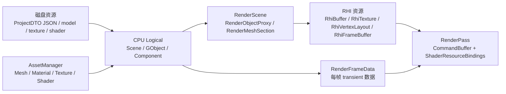
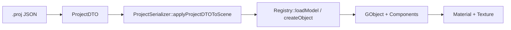
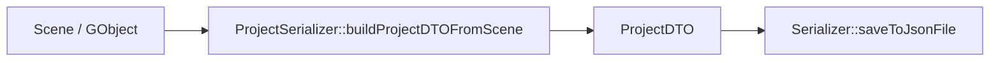
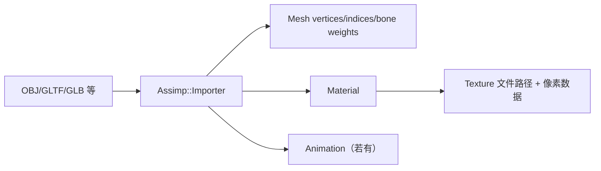
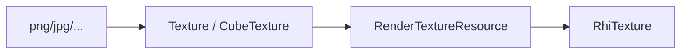
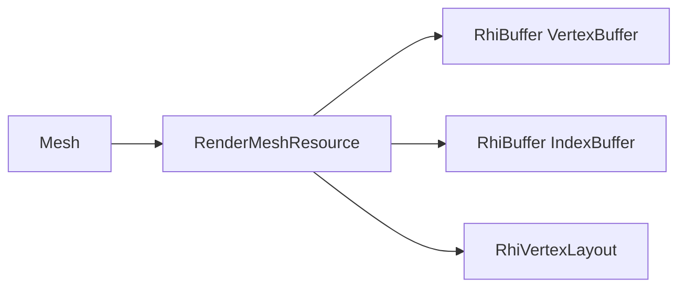
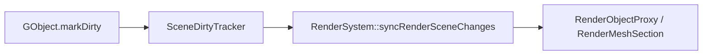

# XPYEngine 资源生命周期梳理

本文梳理当前项目中 mesh、light、shader、material、texture、GObject、Component 等资源在三个层面的表现形式：

- **磁盘层**：项目 JSON、模型文件、纹理文件、shader 文件，以及用于序列化的 DTO。
- **CPU Logical 层**：`Logical` 目录下的运行时对象、组件；`AssetManager` 目录下的 CPU 侧资产数据。
- **GPU / Render 层**：`RenderScene`、`RenderFrameData`、RenderGraph、RHI 资源，以及 RenderPass 如何消费这些数据。

本文描述的是当前代码状态，并在最后给出一版初步优化方案。分层架构详见 [架构.md](架构.md)。

## 总览

当前资源大体按下面的路径流动：



核心入口：

| 流程 | 入口 |
|------|------|
| 项目保存/加载 | `Scene::saveProject()` / `Scene::loadProject()` → `ProjectSerializer` |
| 模型导入 | `SceneObjectRegistry::loadModel()` → `ModelImporter`（Assimp） |
| CPU → Render 同步 | `RenderSystem::syncRenderSceneChanges()`（增量，消费脏标记） |
| 每帧 transient 数据 | `RenderSystem::buildRenderFrameData()` |
| 蒙皮更新 | `RenderSystem::updateSkinnedMeshSections()` |
| GPU 资源创建 | `RenderMeshResource`、`RenderMaterialResource`、`RenderTextureResource` |
| 绘制 | RenderPass 通过 `RhiCommandBuffer`、`RhiGraphicsPipeline`、`ShaderResourceBindings` |

---

## 三层职责

### 1. 磁盘层

磁盘层不是完整运行时对象的 dump，而是「可重建场景」的描述。

主要类型在 `engine/src/AssetManager/include/AssetManager/DTO.hpp`：

- **`ProjectDTO`**
  - `project_name`
  - `objects`
- **`ObjectDTO`**
  - `name`、`visible`、`transform`
  - `filepath`、`file_type`（网格对象）
  - `sub_meshes`、`materials`
  - `has_point_light` / `point_light`
  - `has_directional_light` / `directional_light`
  - `has_camera` / `camera`
- **`SubMeshDTO`**：`sub_mesh_index`、`local_transform`
- **`MaterialDTO`**：PBR / Blinn-Phong 因子 + `textures`
- **`MaterialTexturesDTO`**：`diffuse/specular/normal/height/albedo/metallic/roughness/ao`
- **`TransformDTO`**、`CameraDTO`、`PointLightDTO`、`DirectionalLightDTO`

项目 JSON 只保存引用和编辑态参数。模型顶点、索引、骨骼、纹理像素不直接写入 ProjectDTO，而是通过 `ObjectDTO::filepath` 和 `MaterialTexturesDTO` 中的路径重建。

**当前 ProjectDTO 不包含：** `schema_version`、GObject 父子层级、稳定持久化 object id、RenderParams、AnimationComponent 播放状态。

其他磁盘资源：

- **模型文件**：OBJ、GLTF、GLB 等 Assimp 支持格式。`FileType` 枚举声明了多种类型，但 `ProjectSerializer::applyProjectDTOToScene()` 加载路径目前主要处理 `OBJ` 和 `None`；直接 `loadModel()` 可走 Assimp 全格式。
- **纹理文件**：`Texture` / `CubeTexture` 通过 stb_image 加载。
- **Shader 文件**：位于 `ASSET_DIR/shader/`，`Shader::create(ShaderType)` 硬编码 ShaderType → `.vs/.fs/.gs` 路径映射。
- **序列化机制**：`Meta::Serialization::Serializer` 通过 `AllMetaRegister.hpp` 注册的 DTO 属性读写 JSON。

### 2. CPU Logical 层

CPU Logical 层表示编辑器和游戏逻辑看到的对象；CPU 侧网格/材质/纹理/着色器定义在 **AssetManager**。

#### Scene 与子系统

`Scene` 是门面，聚合四个子系统（详见 [架构.md](架构.md)）：

| 子系统 | 职责 |
|--------|------|
| `SceneObjectRegistry` | 对象注册、创建、`loadModel()`、主相机/光源 ID 缓存 |
| `ProjectSerializer` | `.proj` 读写 |
| `SelectionManager` | GPU 拾取选中状态 |
| `SceneDirtyTracker` | 增量变更队列，供 Render 消费 |

Scene 初始化时自动创建主相机与默认方向光（各为一个带对应 Component 的 `GObject`）。

#### 主要运行时对象

- **`GObject`**：场景树节点；`GObjectID`、`name`、`visible`、parent/children；`std::vector<std::shared_ptr<Component>>`；`dirty` 信号
- **`Component`**：主流程在 `Logical/Framework/Component/*`；ECS 路径在 `Logical/Framework/ECS/`（`ENABLE_ECS=false` 时未启用）

#### 主要组件

| 组件 | 职责 |
|------|------|
| `TransformComponent` | TRS → `Mat4 transform()` |
| `MeshComponent` | `source_filepath` + `sub_meshes` |
| `CameraComponent` | 相机模式、投影、FOV、near/far、view/projection |
| `DirectionalLightComponent` | 方向光颜色、方向、shadow 投影参数 |
| `PointLightComponent` | 点光颜色、半径；位置来自 `TransformComponent` |
| `AnimationComponent` | 动画 clip、路径、播放参数 |
| `RigidComponent` | 占位组件 |

**光源组件化：** 方向光与点光均为 `GObject` + LightComponent，`SceneObjectRegistry` 维护 `m_directional_light_object_ids` / `m_point_light_object_ids` 索引列表。

#### AssetManager（CPU 侧资产）

位于 `engine/src/AssetManager/`：

| 类型 | 职责 |
|------|------|
| `Mesh` / `Vertex` | 顶点/索引、submesh 局部 TRS、材质指针、骨骼权重 |
| `Material` | PBR + Blinn-Phong 双模型字段；`version` 脏标记 |
| `Texture` / `CubeTexture` | 文件路径、像素数据（不含 GL 句柄） |
| `Shader` | CPU 侧 shader 源码；`ShaderType` → 文件路径 |
| `ModelImporter` | Assimp 导入；静态 importer 缓存 |

### 3. GPU / Render 层

Render 层不直接使用 Logical 对象绘制，而是维护长生命周期的 **`RenderScene`** 镜像，并在每帧构建 **`RenderFrameData`** transient 数据。

主要类型在 `engine/src/Render/RenderScene.hpp`、`RenderFrameData.hpp`、`RenderBuiltinResources.hpp`：

#### RenderScene（长生命周期）

```
RenderScene
└── RenderObjectProxy（对应 GObjectID）
    └── RenderMeshSection[]（对应 sub_mesh_idx）
        ├── RenderMeshResource（GPU buffer + vertex layout）
        ├── RenderMaterialResource（GPU texture + 材质因子）
        ├── model_matrix / local_matrix
        └── bone_matrices（蒙皮时）
```

- **`RenderMeshResource`**：由 CPU `Mesh` 创建 `RhiBuffer`（vertex/index/instancing）和 `RhiVertexLayout`
- **`RenderMaterialResource`**：由 CPU `Material` 上传 `RhiTexture*` 并缓存材质因子；`updateFrom()` 同步 Logical 变更
- **`RenderSkybox`**：skybox cubemap + mesh，挂在 `RenderScene` 上

`RenderScene` 维护 pass 消费的分类列表：`visibleMeshSections`、`opaqueMeshSections`、`transparentMeshSections`、`skinnedMeshSections`。

#### RenderFrameData（每帧 transient）

- `directional_lights` / `point_lights`：从 Scene 中带 LightComponent 的 GObject 收集
- `picked_ids`：来自 `SelectionManager`
- `view_matrix` / `proj_matrix` / `camera_position`：来自主相机
- `point_light_inst_amount`：点光 instancing 数量

#### RenderBuiltinResources（跨帧复用）

- `screen_quad`、`point_light_inst_mesh`
- `IBLResources`（irradiance / prefilter / BRDF LUT，启动时预计算）

#### RenderTextureResource（上传辅助）

- 构造时将 CPU `Texture` / `CubeTexture` 上传为 `RhiTexture*`
- 保留 `id` 字段，供 ImGui 显示纹理

#### RHI 资源（`engine/src/Render/RHI/rhi.hpp`）

| 类型 | 职责 |
|------|------|
| `RhiTexture` | GPU 纹理 + native id |
| `RhiBuffer` | 顶点/索引/uniform/storage buffer |
| `RhiVertexLayout` | attribute layout + VAO |
| `RhiFrameBuffer` | render target |
| `RhiGraphicsPipeline` | shader program + 固定渲染状态 |
| `RhiShaderResourceBindings` | draw 前 uniform / texture 绑定 |
| `RhiCommandBuffer` | `beginPass` / `setGraphicsPipeline` / `drawIndexed` / `blit` |

---

## 资源对应关系

| 资源 | 磁盘层 | CPU 层 | Render / GPU 层 |
| --- | --- | --- | --- |
| Project | `.proj` / `ProjectDTO` | `Scene`（门面） | 无直接 GPU 对象 |
| Object | `ObjectDTO` | `GObject` | 零或多个 `RenderMeshSection` |
| Transform | `TransformDTO` | `TransformComponent`、`Mesh` 局部 TRS | `RenderMeshSection::model_matrix` |
| Mesh | 模型路径 + `SubMeshDTO` | `Mesh`（AssetManager） | `RenderMeshResource` |
| Vertex | 模型文件 | `Vertex` | vertex/index buffer |
| Material | `MaterialDTO` | `Material`（AssetManager） | `RenderMaterialResource` + `ShaderResourceBindings` |
| Texture | texture filepath | `Texture` / `CubeTexture` | `RhiTexture` |
| Shader | shader 文件 | `Shader`（AssetManager） | `RhiShaderStage`、`RhiGraphicsPipeline` |
| Pipeline | 不在磁盘保存 | `ShaderType` + `RenderPipelineState` | `RhiGraphicsPipeline`（`RenderPipelineLibrary` 缓存） |
| Light | `ObjectDTO` 内 `has_*_light` | `DirectionalLightComponent` / `PointLightComponent` | `RenderDirectionalLightData` / `RenderPointLightData`、shadow map |
| Camera | `ObjectDTO` 内 `has_camera` | `CameraComponent` | `RenderFrameData` 矩阵 |
| Animation | 模型文件 + `AnimationComponent::clip_path` | `Animation`、`AnimationSystem` | `RenderMeshSection::bone_matrices` |
| RenderTarget | RenderPath 代码声明 | RenderGraph 资源名（`RGResource::*`） | `RhiFrameBuffer`、attachment `RhiTexture` |
| IBL | 可选 HDR 文件 | — | `RenderBuiltinResources.ibl` |

---

## 转换流程

### 项目加载：磁盘 JSON → Scene



步骤（`ProjectSerializer::loadProject`）：

1. `Serializer::loadFromJsonFile()` 反序列化为 `ProjectDTO`。
2. `applyProjectDTOToScene()` 遍历 `dto.objects`：
   - 有 `filepath` → `loadModel()` 创建带 `MeshComponent` 的 GObject。
   - 仅 `has_camera` → 恢复/创建相机 GObject。
   - 仅 `has_*_light` → 创建光源 GObject 并挂载 LightComponent。
3. 覆盖 transform、submesh local transform、material 参数与 texture 路径。
4. 恢复 camera / point light / directional light 组件字段。
5. 对每个对象 `markDirty`，触发 Render 增量或全量同步。
6. 若缺少主相机或方向光，自动补建默认实例。

**加载注意：**

- `clear_old=true` 时清空对象列表，但保留主相机 GObject。
- 网格路径在 ProjectDTO 中存相对路径，加载时拼为绝对路径。

### 项目保存：Scene → JSON



步骤（`ProjectSerializer::buildProjectDTOFromScene`）：

1. 遍历 `Registry::getObjects()`。
2. 跳过无 MeshComponent / CameraComponent / LightComponent 的对象。
3. 写入 name、visible、transform。
4. 有 MeshComponent 时：保存相对 `filepath`、submesh local transform、material 参数与 texture 相对路径。
5. 有 CameraComponent / LightComponent 时：写入对应 DTO 字段（`has_camera`、`has_point_light`、`has_directional_light`）。

**当前仍不保存：**

- GObject 树状父子关系。
- 稳定持久化 object id。
- RenderParams（渲染路径、后处理开关等）。
- AnimationComponent 播放状态（clip 路径在模型加载时可重建，但播放参数不持久化）。

### 模型导入：模型文件 → Mesh / Material

入口：`SceneObjectRegistry::loadModel()` → `ModelImporter`。



`ModelImporter::load()`：

- 静态缓存 `Assimp::Importer`，key 为模型路径。
- 后处理：`aiProcess_Triangulate | aiProcess_FlipUVs | aiProcess_GenNormals | aiProcess_CalcTangentSpace`。

`ModelImporter::meshOfNode(ai_mesh_idx)`：

- 读取 position / normal / uv / bone weights / indices。
- 调用 `load_material()` 创建 `Material`。

`ModelImporter::load_material()`：

- 先创建完整默认材质。
- glTF/GLB 或 Cook-Torrance shading model → PBR 路径，否则 Blinn-Phong。
- 两套字段通过 `fillPBRFromBlinnPhong()` / `fillBlinnPhongFromPBR()` 互填兼容值。

有动画时自动添加 `AnimationComponent`，clip 从同一模型文件构建。

### Texture：文件 → RhiTexture



- CPU `Texture` 持有像素数据；`RenderTextureResource` 构造时调用 `Rhi::newTexture()` 上传。
- `RenderMaterialResource` 持有 `RhiTexture*`；Pass 通过 `ShaderResourceBindings::setTexture()` 绑定。
- OpenGL backend 在 `setShaderResources()` 内取 `texture->id()`。

### Mesh：CPU Mesh → GPU Buffer



Vertex layout attributes：

| Location | 内容 |
|----------|------|
| 0 | position，Float3 |
| 1 | normal，Float3 |
| 2 | uv，Float2 |
| 3 | bone ids，SInt4 |
| 4 | bone weights，Float4 |
| 5–8 | instancing 矩阵（动态 buffer） |
| 9 | instancing 颜色 |

### Material：CPU Material → ShaderResourceBindings

`RenderMaterialResource::updateFrom()`：

- 同步数值因子（PBR + Blinn-Phong + alpha）。
- 记录 `material_version = material->version`。
- **懒加载纹理**：各 `RhiTexture*` 仅在指针为空时通过 `RenderTextureResource` 创建；贴图替换时尚未完整失效重建（见下方问题 #2）。

RenderPass 按 `RenderParams::material_model` 选择绑定 PBR 或 Blinn-Phong 贴图集。

### Shader：shader 文件 → GraphicsPipeline

```
Shader 文件 → Shader（CPU 源码）→ RenderPipelineLibrary → RhiGraphicsPipeline → CommandBuffer
```

`RenderPipelineLibrary` 按 `ShaderType` + `RenderPipelineState` + 可选 `RhiVertexLayout` 缓存 pipeline。

### Light：CPU LightComponent → RenderFrameData / ShadowMap

CPU 层（GObject + Component）：

- `DirectionalLightComponent`：颜色、方向、`lightViewMatrix()` / `lightProjMatrix()`
- `PointLightComponent`：颜色、半径；位置来自 `TransformComponent::translation`

Render 层（`buildRenderFrameData` 每帧构建）：

- `RenderDirectionalLightData`：color、direction、lightViewMatrix、lightProjMatrix
- `RenderPointLightData`：id、color、position、radius、6 面 view matrix、projection
- 点光可视化：`point_light_inst_mesh` instancing buffer

Shadow 资源（RenderGraph 声明）：

- 方向光：`ShadowDirectionalColor`、`ShadowDirectionalDepth` → `ShadowPass`
- 点光：`RGTarget::ShadowPointDepth` cubemap → `ensureCubeShadowMapsCount()`

### Logical → RenderScene：脏标记增量同步



`RenderSystem::onUpdate()` 每帧顺序：

1. `syncRenderSceneChanges(scene)` — 消费 `scene.consumeChanges()`，按 `SceneDirtyFlag` 增量更新或全量重建 `RenderScene`。
2. `updateSkinnedMeshSections()` — 从 `AnimationSystem` 拉骨骼矩阵写入 skinned sections。
3. `buildRenderFrameData(scene)` — 收集灯光、相机、选中 ID。
4. `m_curr_path->render(...)` — RenderGraph 执行。

**脏标记处理：**

| 标志 | Render 动作 |
|------|-------------|
| `FullResync` | `rebuildRenderSceneFromScene` |
| `Removed` | `removeObjectProxy` |
| `Created` / `Mesh` | `rebuildObjectRenderProxy` |
| `Visibility` | `setObjectVisible` |
| `Transform` | `updateObjectTransform` |
| `Material` | `updateObjectMaterials` → `RenderMeshSection::updateRenderMaterial` |

首帧 `SceneDirtyTracker` 默认 `m_full_resync = true`，触发一次全量同步。
